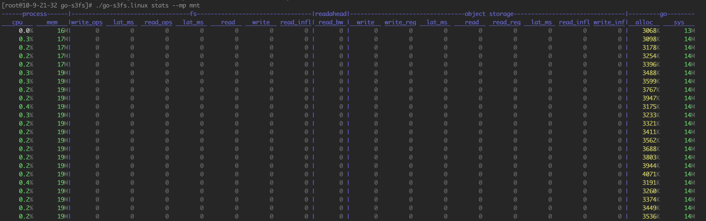

# go-s3fs

go-s3fs 是一个可在 linux/macos 中，将 S3 的 bucket 挂载到本地挂载点的工具，挂载成功后，您可以像操作本地文件一样操作bucket中的文件。

## 运行环境

go-s3fs基于用户态fuse实现，您的机器需要支持fuse，且fuse版本大于7.23。

## 下载链接

见 release

## 主要特性

* 适配任何使用S3协议的对象存储提供商
* 支持POSIX文件系统的大部分功能，如读，顺序写；权限；uid/gid。
* 比`s3fs-fuse`有着更高的性能
* 支持挂载点访问权限控制

## 使用限制

* 仅支持顺序写，不支持随机写/追加写
* 不支持硬/软链接
* 由于对象存储端的限制，rename会替换成copy+delete，因此rename是非原子性的操作

-----

## 配置账号访问信息

编辑 /etc/go-s3fs/go-s3fs.yaml 并增加如下信息(如果没有该目录需要自行创建):

```
bucket: <your bucket name>
access_key: ************************************
secret_key: ************************************
endpoint: <s3 endpoint, like: s3-us-west-2.amazonaws.com>
```

*冒号后有单个空格*

* **bucket**: 桶名，需要和挂载的桶名一致
* **access_key**: 公钥，支持token秘钥和api秘钥两种模式
* **secret_key**: 私钥，支持token秘钥和api秘钥两种模式
* **endpoint**: s3的访问域名

下载go-s3fs后。使用`chmod +x go-s3fs`增加可执行权限，如果需要直接执行，可将go-s3fs移动到/bin目录下。示例：

```bash
chmod +x go-s3fs
./go-s3fs --passwd=passwd_file <bucket> <mountpoint>
```

## 使用方式

* 挂载

```
go-s3fs [global options] <bucket> <mountpoint>
```

* 卸载

```
umount <mountpoint>
```

* 前台挂载

```
./go-s3fs --passwd=passwd_file -f <bucket> <mountpoint>
```

### 开启日志

go-s3fs的日志默认会输出到系统日志里，如果想要设置日志级别或日志输出目录，示例如下

```
./go-s3fs --passwd=passwd_file --level debug --log_dir /var/log/go-s3fs/ <bucket> <mountpoint>

```

## 查看帮助

通过`go-s3fs -h`查看go-s3fs支持的参数

```
NAME:
   go-s3fs - go-s3fs [global options] <bucket> <mountpoint>

USAGE:
    [global options] command [command options] [arguments...]

VERSION:
   S3FS Version: v1.0.0
  Commit ID: 73f2891
  Build: 2023-10-22:01:19:35
  Go Version: go1.21.0 darwin/arm64

COMMANDS:
   stats    show stats
   reload   reload configuration
   gc       execute golang rumtime.GC()
   help, h  Shows a list of commands or help for one command

GLOBAL OPTIONS:
   --help, -h                    show help
   -f                            foreground
   --dcache_timeout value        How long to cache dentry for go-s3fs (default: 5m0s)
   --retry value                 Number of times to retry a failed I/O (default: 5)
   --parallel value              Number of parallel I/O thread (default: 32)
   --disable_remove              Disable remove op, such as unlink, rmdir, rename
   --debug                       Set debug level for fuse/winfsp
   --level value                 Set log level: error/warn/info/debug (default: "info")
   --log_dir value               Set log dir
   --log_max_age value           Set log max age (default: 72h0m0s)
   --log_rotation_time value     Set log rotation time (default: 1h0m0s)
   --enable_load_dentries        enable auto init dentries in memory
   --read_after_write_finish     read operation will wait all write operation done
   --finish_write_when_release   all written data will be uploaded when release
   --readahead value             Readahead size. e.g.: 1m/1k/1  (default: "0")
   --max_cache_per_file value    Max cache per file when enable readahead. e.g.: 32m/64m/128m  (default: "1024m")
   --etag value                  Check etag for part. value is percent(0~100) (default: 50)
   --passwd value                specify access file (default: "/etc/go-s3fs/go-s3fs.yaml")
   -o value                      Specify fuse/winfsp option
   --uid value                   Specify default uid (default: 0)
   --gid value                   Specify default gid (default: 0)
   --mp_mask value               Specify mountpoint mask (default: 0)
   --disable_check_vdir          disable detection of virtual directories
   --prefix value                Specify bucket prefix path
   --direct_read                 Enable cache bypass read
   --skip_ne_dir_lookup          Skip non-essential directory checking, such as files ending in ".log",".png",".jpg", etc.
   --storage_class value         Storage type, including "STANDARD", "IA" (default: "STANDARD")
   --entry_timeout value         How long to cache dentry for inode for fuse. (default: 5m0s)
   --attr_timeout value          How long to cache inode attr for fuse (default: 5m0s)
   --disable_async_read          Disable all read (even read-ahead) operations asynchronously
   --max_background value        Specify the max_background parameter of fuse kernel(>=7.13), currently fuse usespace supports up to 1024 (default: 64)
   --congestion_threshold value  Specify the congestion_threshold parameter of fuse kernel(>=7.13), currently fuse usespace supports up to 768 (default: 48)
   --async_dio                   Enable the async_dio parameter of fuse kernel, async_dio is disabled by default
   --keep_pagecache              Turn on pagecache, when the file is opened, it will be decided whether to update according to the modification time of the inode, so please pay attention to the attr_timeout and dcache_timeout parameters will have a certain impact on this
   --version, -v                 print the version
```

## 设置fuse层参数

* fuse常用选项列表（与`-o`一起使用）

| 选项名称    | 描述                                     |
| ----------- | ---------------------------------------- |
| allow_other | 指定文件系统可以所有用户访问<br>默认关闭 |
| ro          | 指定当前文件系统为只读                   |

**使用方式**

```bash
-o option=value
```

## 本地服务支持

ubuntu和centos等使用systemctl的发行版可用以下方式:

在`/etc/systemd/system/`目录下创建名为`go-s3fs.service`的文件，并增加如下内容

```bash
[Unit]
Description=GO_S3FS (User Space FileSystem for S3)
Requires=network-online.target
After=network-online.target

[Service]
Type=forking
User=<user>
Group=<group>
Restart=always
RestartSec=10
ExecStart=/bin/go-s3fs --passwd=/etc/go-s3fs/go-s3fs.yaml  <your_bucket> <mountpoint> 
ExecStop=/bin/umount <monutpoint>
[Install]
WantedBy=multi-user.target
```

* *User*为需要访问挂载点的用户。如为root，则可省略
* *Group*为需要访问挂载点的用户组。如为root，则可省略
* *ExecStart*为挂载命令，按照需要自行填写

执行`systemctl dameon-reload`后。可使用`systemctl start go-s3fs.service`启动服务，`systemctl stop go-s3fs.service`停止服务；`systemctl restart go-s3fs.service`重启服务；`systemctl statue go-s3fs.service`查看服务状态。`systemctl enable go-s3fs.service`设置为开机自启动。

## 查看监控



## 自带pprof

go-s3fs启动时，会在8899端口监听pprof，方便问题定位
